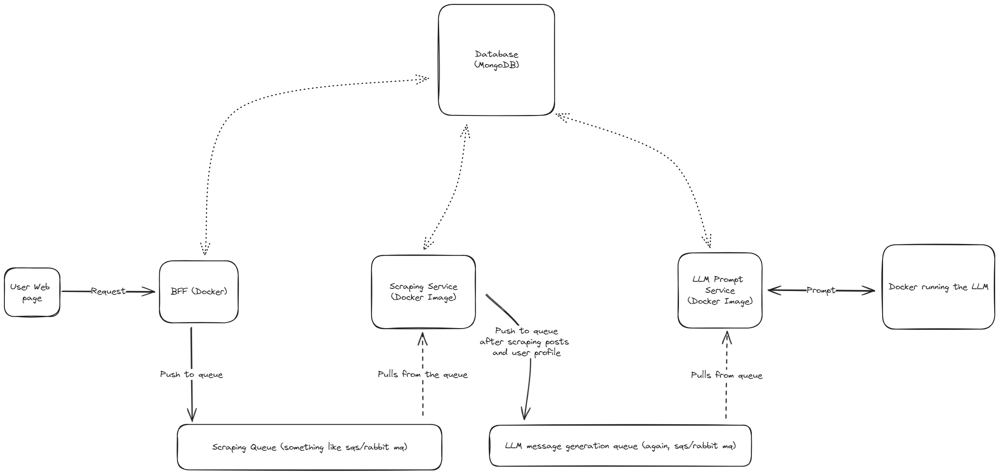

# LKDIN_LLM_SERVICE



## BFF Service

* This service is responsible for authenticating with the web client and providing apis for the web. We could have different BFFs for different user interfaces (web/mobile/desktop). Currently I'm only considering a web client and although authentication should be a separate servic, I've included it with this BFF Service.
* Using a very simple `api key` in the header authentication mechanism here.

## Database

- I'm going with MongoDB here because of the flexibility of NOSQL databases and also I have more experience with NOSql.

- MongoDB Docker setup guide : [Here](https://medium.com/@analyticscodeexplained/seamless-development-a-step-by-step-guide-to-installing-mongodb-with-docker-20eb6649b8dc)
    ```sh
    docker pull mongo
    docker run -d -p 27017:27017 --name mymongodb mongo
    ```

## Queue Service

```sh
docker run -d --rm --name rabbitmq -p 5672:5672 -p 15672:15672 rabbitmq:4.0-management
```

## Scraping Service

## LLM Docker

# Development process