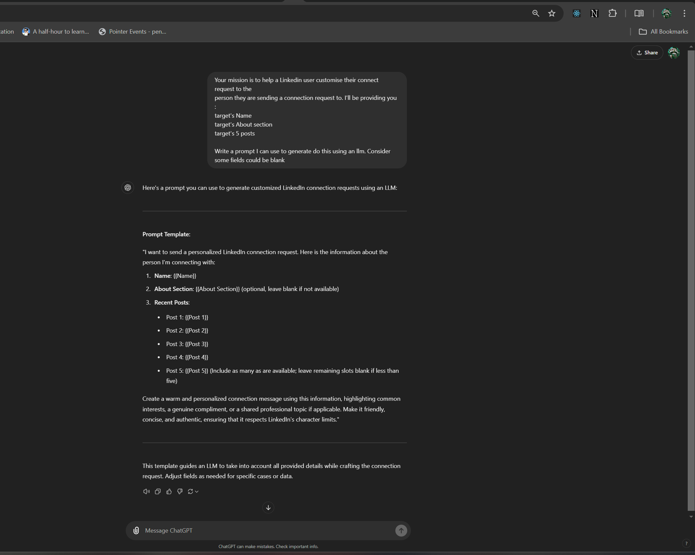

# LKDIN_LLM_SERVICE


## BFF Service

* This service is responsible for authenticating with the web client and providing apis for the web. We could have different BFFs for different user interfaces (web/mobile/desktop). Currently I'm only considering a web client and although authentication should be a separate service, I've included it with this BFF Service.
* Using a very simple `api key` in the header authentication mechanism here.

## Database

- I'm going with MongoDB here because of the flexibility of NOSQL databases and also I have more experience with NOSql.

- MongoDB Docker setup guide : [Here](https://medium.com/@analyticscodeexplained/seamless-development-a-step-by-step-guide-to-installing-mongodb-with-docker-20eb6649b8dc)

## Queue Service

Went with RabbitMQ here.
I have heard abou Kafka and RabbitMQ. A quick google search told me RabbitMQ is a better fit for this requirement since i'm queuing some work here

## Scraping Service

Although the assignment mentions to use Python/Golang, I find Puppeteer to be a better (reliable and light) solution than Selenium. Puppeteer does not have official python/golang support. Hence, I went with JavaScript here since it was the best fit for the task.
Scraping script is pretty straightforward :
- Subscribe to the scraping queue
- On recieving a requestid, query db, fetch details (userid, password and target). Now here userid and password should be encrypted but that felt out of scope for a single day task
- Scrape data by logging into linkedin with the available credentials
- Fail or Success, update status and results in db.
- Push the requestid to LLM Prompt queue.
- Done

## LLM Service

This consists of 2 docker images. One running ollama to actually respond to prompts, another running a python worker subscribed to llm prompt queue.
The worker creates a prompt and uses ollama docker to fetch response for the prompt. I used `CHAT GPT` to create a good prompt here.

Attaching my conversation with chatgpt below


## UI

Initially I was going to build a frontend using ReactJS but I was using `FASTAPI` in the BFF service which comes with an autogenerated swagger docs ui.
So I decided to leave it there.

# Steps to run

> Important
First Step would be to go into bff and create a `.conf` file. This is where you specify your stage wise environment for the BFF Service. I'm attaching a sample below. Copying it as is should also work.
```conf
[LOCAL]
DB_URI=mongodb://mongodb:27017
QUEUE_URI=rabbitmq
dev_creds=local_usr_dev_1:local_password,local_usr_dev_2:local_password_2

[PROD]
DB_URI=mongodb://mongodb:27017
QUEUE_URI=rabbitmq
dev_creds=local_usr_dev_1:local_password,local_usr_dev_2:local_password_2
```
Notice the `dev_creds`. This will be used to access the `/docs` and `/redoc` pages. It is a comma separated list of credentials in format `{username}:{password}`

Docker compose should do all the trick for you. Packaged everything accordingly.
```sh
docker compose up -d
```

Once all the services are up, you can install any mongo client (Robo3t, Mongodb Compass, etc) to view the empty database created using the uri string `mongodb://localhost:27017/`

Next you should be able to browse to `http://localhost:8080/docs/` and `http://localhost:8080/redoc/`. It will ask you for credentials, use the ones specified in your `.config` file in `bff` service.

Next you'll see in the docs that we require x-api-key to make any api call and we recieve Unauthorized error when we don't provide a valid value. We'll have to generate some user accounts now (I have not yet added any sort of signup functionality).

Using a python virtual environment based off on `bff/requirements`, execute `python populate-default-users.py` script.

Now go back to mongodb and you'll see an entry in `users` collection. Use the api key from there to make api calls on SwaggerUI

Everything else should be self explanatory, go through the docs and the design diagram attached in the beginning of this README.

Feel free to contact me for any other issues.

## Observations
> IMP

* Sometimes linkedin sends confirmation notification on your phone, you'll have to accept it in under 30seconds or scraping will fail because of a timeout. We can definitely solve this as well but outside the scope of this assignment.

* Ollama currently takes a while to pull the llama model. meanwhile our services are in the ready state, now if we create a request before ollama has pulled the image, it will fail. So wait some time, check the ollama docker logs, create requests after it's downloaded the model. Took me a solid 10 mins to download the model for the first time. It get's cached after that.

## Future Scope
* Encrypt linkedin credentials
* Handle linkedin login confirmation gracefully
* Queuing service sometimes disconnects from the BFF. Look into that. Make it more stable
* Handle cases where users might not have custom linkedin urls.
* Vulnerabilities in our mechanism wherein somebody can inject query strings to our scraping calls.
* We could add a command to healthcheck for ollama so it does not spawn the other services before ollama is itself ready. But I'm feeling too lazy to do that now.

## OUTPUT

Adding a sample response here from my testing
```json
[
  {
    "lnkd_request_id": "01JC1FDZ7GHVVC1J5VHCT280CG",
    "tagret_profile": "emircatli",
    "target_headline": "CRO @ HockeyStack | Helping B2B revenue teams create and capture more demand",
    "target_name": "Emir Atli",
    "target_about": "Hiring across all functions in San Francisco. Send an email to emir@hockeystack.com with proof of extraordinary talent.Co-founder of HockeyStack, the Command Center for B2B Revenue TeamsHiring across all functions in San Francisco. Send an email to emir@hockeystack.com with proof of extraordinary talent.\n\nCo-founder of HockeyStack, the Command Center for B2B Revenue Teams",
    "posts": [
      {
        "content": "🚨 HockeyStack is hiring for 30+ open roles 🚨We added 150 customers in a year, getting ready to announce our biggest milestone yet, and looking to expand our team with top 1% talent. Looking to hire for these roles:Sales:- SDR (5 in Q4)- AE (2 in Q4)Product & Engineering:- Devops (2 in Q4)- Backend Eng (10+ Q4-Q1)- Product Eng (10+ Q4-Q1)- Support Eng (2-3 in Q4)- Product DesignerMarketing & Growth:- Growth (A founder-type to run experiments and ride shotgun with me. If you are a solo-founder, we can also acquire your company)- Events- Demand genWhy join HockeyStack:- Entering a new stage of growth that we’ve been keeping as a secret- Unrivaled in our category. “Competitors” still trying to pitch touchpoint credit- First platform the be the brain for GTM with data across all tech stack- AI-first. Just launched our AI-marketing analyst and have more in pipeline- Smartest people I know work with us, and everyone is friends outside workWe are working in person at our San Francisco office. Relocation support is provided. Reach out to me for GTM roles and Rajalakshmi for eng. Help someone find their next role by sharing/commenting on this post!\n      \n    \n  \n          \n          …more",
        "time_ago": null
      },
      {
        "content": "On Saturday Sam Jacobs said, \"cold outbound is dead.\" But Rippling's CRO just said they're booking the MAJORITY of their meetings from cold outbound at $350M ARR. Here are 3 things killer outbound teams are doing right now:1. Call Heavy CultureThe top-performing outbound orgs are call-first right now. I used to think “I'm not picking up the phone, so nobody else will.\"I was 100% wrong.Sure, you will piss some people off (just ask Alex Choi).But we book 1-2 meetings a day per rep on the phone.Much more effective than any other channel + provides feedback much faster. We use Nooks. The team loves the product.I love how they destroy incumbents. 2. In-Person Sales FloorI am obviously biased, and if you know me, you would know I will die on the “remote-work is bad for sales” hill. BUT in-person JUST WORKS especially well for sales dev teams. New hires to our sales dev team start booking their first meetings only 10 days after starting.I believe it’s close to impossible to achieve such fast ramp times if you are remote and don’t have the F2F time with your sales dev leader.3. Constant, Creative IterationWe do weekly opp teardown sessions to find out if there is anything we can improve, any creative ways we booked meetings, or things we need to change.If someone books a meeting in a different way, other reps immediately learns and adapts. A new playbook is written and shipped the next day to the team.Speed of evolution over EVERYTHINGBONUS:Most companies that struggle with outbound are selling a feature, not a product. As building tech gets easier, we see “features” re-branded as “products” and entire companies in B2B SaaS.Most orgs that I see struggling with outbound have a much bigger problem that cannot be solved by building a better brand and opening up more inboxesTAKEAWAY:Sam is super sharp.I’m a proud Pavilion member.And I don’t disagree with him when he says:“The way we buy is changing.Trust is the only thing that can get deals done these days.”But HockeyStack and Rippling are both crushing it with cold outbound.So while cold outbound has changed, I don’t believe it’s DEAD.Most companies that sell a real need are still THRIVING.Yes, outbound is harder, and requires more volume, and constant iteration.But is there any GTM tactic that doesn’t require these in 2024?\n      \n    \n  \n          \n          …more",
        "time_ago": null
      },
      {
        "content": "I received this gift yesterday- it’s a screenshot of my LinkedIn post on a water bottle. I can’t figure out who sent it 🤣 Please let me know if it’s you!",
        "time_ago": null
      },
      {
        "content": "“We regret to inform you that you have been found ineligible for an immigrant visa.” My heart sank. Not only were we going to be removed from Y Combinator 15 days before starting… we had to leave the US immediately.We’d applied 4x to YC before we got in.But our acceptance letter was quickly followed with a visa denial by the US government.With no other options, my co-founder Emir and I flew 7,000 miles back to Turkey.When we arrived, the consulate said it would take 18 months to get the stamp we needed. There were no exceptions.But we couldn’t give up on this opportunity.YC emailed Nancy Pelosi (yes, that Nancy Pelosi), and she sent a letter to the consulate, we searched for connections that could escalate until we found THE ONE person who could help us get the stamp we needed.We made it back to the US a day before YC started.We were groggy and jet-lagged, but it was the best day of my life.Why am I sharing this?HockeyStack could never have succeeded without YC. I’m incredibly grateful to Garry Tan and Paul Graham for their support of founders.As immigrant founders, we have faced countless challenges building and scaling HockeyStack. Everything from raising money to hiring is harder as an immigrant founder. VCs are looking for people who graduated from US colleges, have a network here, and worked at a previous US based companyBut all of those challenges helped us get to where we are today.I love Turkey, and it has an emerging tech scene, but… The US is still the best place on earth to build. Especially San Francisco. Around 45% of Fortune 500 companies were founded by immigrants or their children. If you are a founder or executive on this journey, don’t give up. In the end, all these challenges turns into fun memories. Feel free to reach out to me if you need support ❤️\n      \n    \n  \n          \n          …more",
        "time_ago": null
      },
      {
        "content": "Our BIGGEST launch ever is here. Meet Odin - your new AI Marketing Analyst. It can analyze any dashboard, recommend next steps, and have chat built-in for follow up questions.Marketing teams have enormous amounts of data.Thousands of pages, millions of dollars in paid spend, events, webinars, different business units, and more.Odin helps you focus on taking action - and avoid drowning in data.This is the FIRST of FOUR new products coming out of HockeyStack this quarter.I am very excited to bring a long-term vision to life.It’s time to have real marketing and sales collaboration AND have time to focus on things that drive revenue.\n      \n    \n  \n          \n          …more",
        "time_ago": null
      }
    ],
    "message": "Here's a personalized connection request message for Emir Atli:\n\n\"Hi Emir,\n\nI've been following your work at HockeyStack, and I'm impressed by the impact you're making in the B2B revenue space. As someone who values innovative marketing strategies, I'd love to connect with you outside of LinkedIn.\n\nYour journey as an immigrant founder is truly inspiring, and I appreciate the vulnerability you shared about facing challenges building HockeyStack. Your determination and perseverance are a testament to your leadership skills.\n\nOn a personal note, I enjoyed seeing that water bottle with your post screenshot on it - it made me smile! \n\nIf you're open to it, I'd love to explore how our work in [industry/field] might intersect and learn from each other's experiences. Your expertise in B2B revenue teams aligns well with my own interests.\n\nLooking forward to potentially connecting and learning more about your journey!\n\nBest regards,\n[Your Name]\"\n\nThis message:\n\n* Shows interest in Emir's work and accomplishments\n* Acknowledges their journey as an immigrant founder and the challenges they faced\n* Includes a lighthearted, personal touch (water bottle screenshot)\n* Expresses enthusiasm for exploring potential connections and learning from each other",
    "status_message": "Message Generated",
    "status": 5
  }
]
```

I've also attached some `/docs` and `/redoc` images in `/images`.

* [Docs](./images/docs.pdf)
* [Redoc](./images/redoc.pdf)
* [Docker](./images/container.png)